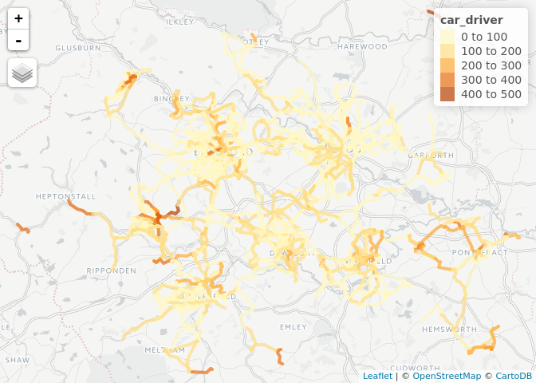

ShortCar Journeys: a new layer for the PCT
================

Setup
-----

``` r
library(dplyr)
library(tmap)
library(sf)
```

Access data
-----------

The data was downloaded as follows:

``` r
if(dir.exists("shortCarJourneys")) setwd("shortCarJourneys")
base_url = "https://github.com/npct/pct-outputs-regional-notR/raw/master/commute/msoa/"
pct_files = c("c.geojson", "l.geojson", "rf.geojson", "rq.geojson", "rnet.geojson", "z.geojson")
region = "west-yorkshire/" # can change
i = pct_files[1]
if(!file.exists("c.geojson")) {
  for(i in pct_files) {
  download.file(paste0(base_url, region, i), i)
  }
}
```

``` r
cents = st_read(dsn = "c.geojson")
l = st_read(dsn = "l.geojson")
rf = st_read(dsn = "rf.geojson")
rnet = st_read(dsn = "rnet.geojson")
z = st_read(dsn = "z.geojson")
```

Short car journeys in the region
--------------------------------

We set a limit defining short car journeys as 5 km on the 'fast' routes. In practice this could be any distance. We also set a limit on the minum number of people who drive to work, to focus the data:

``` r
max_distance = 5
min_drivers = 50
```

These can be selected and visualised as follows:

``` r
short_car_journeys = rf %>% 
  filter(rf_dist_km < 5, car_driver > 50)
tmap_mode("view")
```

    ## tmap mode set to interactive viewing

``` r
qtm(short_car_journeys, lines.col = "car_driver", alpha = 0.1, lines.lwd = 4)
```


